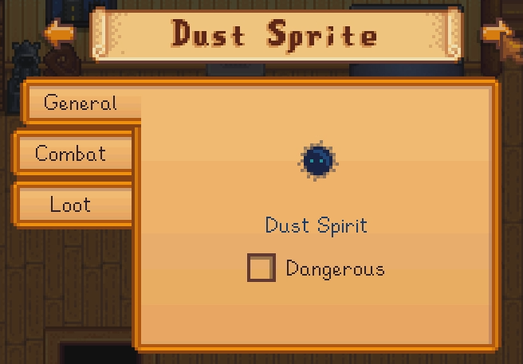
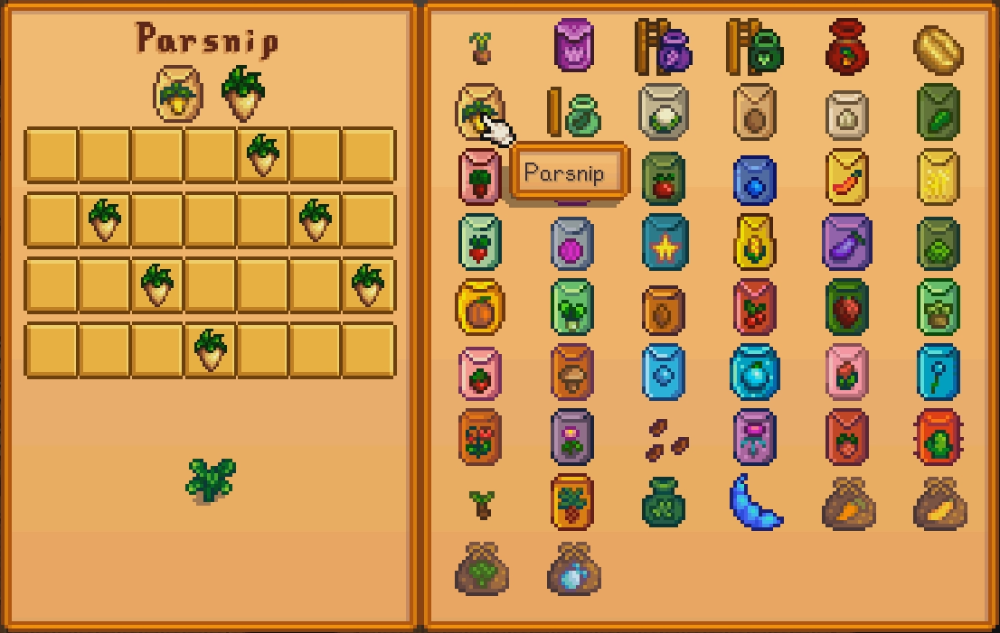

# Examples [:material-file-code-outline:](https://github.com/focustense/StardewUI/blob/dev/TestMod/Examples/){ title="C# Source" } [:material-file-star-outline:](https://github.com/focustense/StardewUI/blob/dev/TestMod/assets/views/){ title="StarML Source" }

Curated list of examples built with StardewUI to demonstrate the many features of the framework and how to use them.

The most current source for any example can usually be found in the `dev` branch of the [test mod](https://github.com/focustense/StardewUI/tree/dev/TestMod). If an example isn't part of StardewUI's source, e.g. if it is an abstract of a real mod, then it will be specified on the individual page; click the [:material-file-code-outline:](#){ title="C# Source" } and [:material-file-star-outline:](#){ title="StarML Source" } links next to the title.

-   [**Scrolling Item Grid**](scrolling-item-grid.md)  
    _@focustense_

    

-   [**Bestiary**](bestiary.md)  
    _@mushymato, @focustense_

    

-   [**Crop Calendar**](crop-calendar.md)  
    _@mushymato_

    

