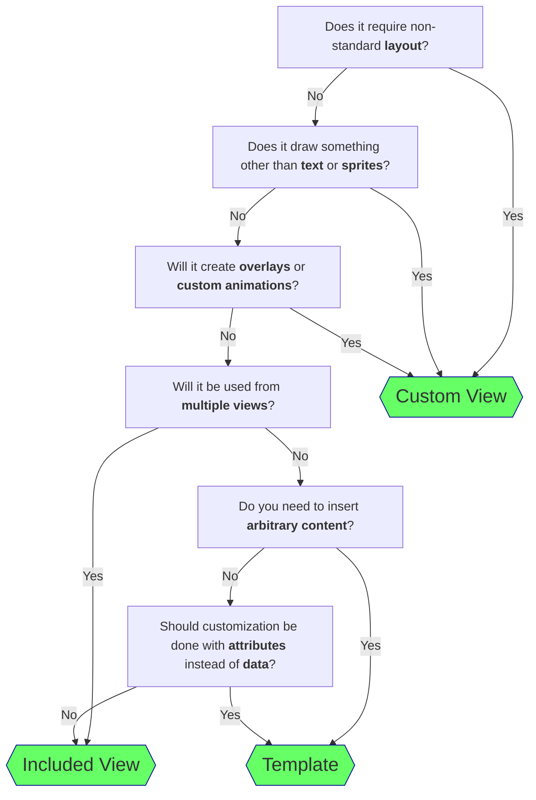

# The DRY Guide

[DRY](https://en.wikipedia.org/wiki/Don%27t_repeat_yourself) is a software development acronym that stands for: _Don't Repeat Yourself_.

When code (or markup) starts to accumulate a lot of copy-paste code or [boilerplate](https://en.wikipedia.org/wiki/Boilerplate_code), it becomes error-prone and hard to maintain, both for the original author and for future maintainers—which, in the case of a game mod, can also include other mod authors who want to base their mod on yours.

This page is designed to be a guide and quick reference for mod authors using the [UI Framework](index.md) on how to DRY, whether it's reduce boilerplate, refactor complex views, or just improve the overall consistency of a mod's look and feel.

## Reusable Components

StardewUI provides a few different strategies for creating reusable "components", each with its own tradeoffs.

/// html | div.annotate.semi-dense.no-header-break

| Feature                                    | Scope(1) | Usage | Target                                               | Expansion(2) | Parameterization                                        |
| ------------------------------------------ | -------- | ----- | ------------------------------------------------------------ | --------- | ------------------------------------------------------- |
| [Templates](templates.md)                  | Local    | Tag   | Document ([Node&nbsp;Transformer](../reference/stardewui/framework/dom/inodetransformer.md)) | Static   | [Template attributes](templates.md#template-attributes) |
| [Included Views](included-views.md)        | Global   | Asset | Binding ([View Node](../reference/stardewui/framework/binding/iviewnode.md)) | Dynamic   | [Context](binding-context.md) only                      |
| [Custom Views](extensions.md#custom-views) | Global   | Tag   | Compiled ([View Factory](../reference/stardewui/framework/binding/iviewfactory.md)) | Static    | [Normal attributes](starml.md#common-attributes)        |

///

1.  **Local** means available for use in the same view (`.sml`) file only; **Global** means available for use in any view.
2.  **"Dynamic"** means the ability to change _which_ template is used, allowing a UI to display content that is not be known ahead of time and may even be from another mod.

The following flowchart may help decide on a strategy:

These are simply guidelines to help you choose—in practice, most UIs can be built using any or none of the above methods, and a well-designed project with a complex UI will most likely use several or all of them.
