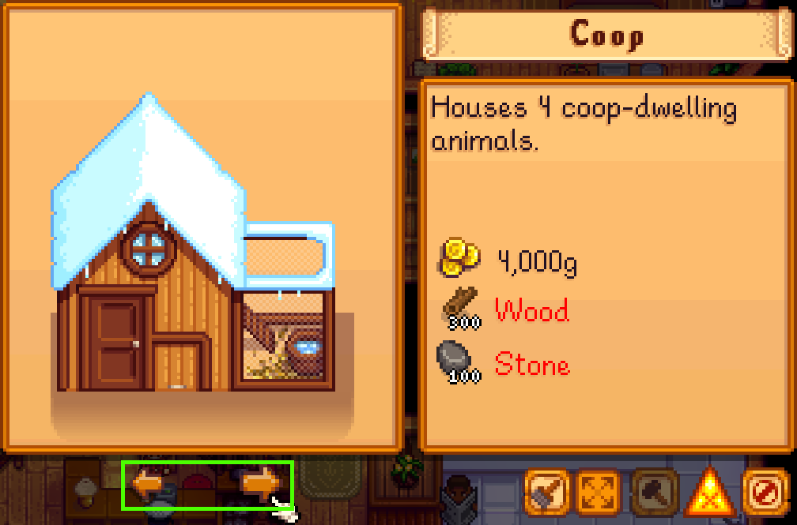

# Focus and Interaction

Most UI and frontend frameworks have some concept of input focus—which element on screen the user is currently interacting with. MonoGame, being the barebones framework that it is, does not have such a concept, and Stardew Valley does not really add one; instead, it introduces a setting named "controller-style menus" (internally, "snappy menus") with these characteristics:

- The cursor is drawn as a hand, instead of an arrow, when using a controller;
- Pressing the left stick in any direction "snaps" the cursor—in theory—to the next element in that direction, instead of moving it freeform;
- Pressing any directional button has equivalent behavior to the left stick, instead of doing nothing.

As controller navigation in the vanilla game is nearly unusable without this setting—at the time of writing, turning it off results in both the arrow _and_ hand cursor being drawn on top of each other, so it is not even consistently tested—the rest of this page assumes controller input using controller-style menus.

Focus in Stardew Valley does not really exist, but a reasonable approximation is simply "whichever element contains the cursor", with focus order or "tab order" being equivalent to the "snap order" used in game. The question then becomes which elements are actually "snappable", or _focusable_.

## Focusability

If you've worked with vanilla UI in Stardew—i.e. manual implementations of `IClickableMenu`—then you know that focus, or snapping, is entirely based on a menu's clickable component list; literally, a `List<ClickableComponent>` whose elements define neighbor IDs in each direction as well as several other metadata fields (visibility, name, tooltip, etc.), all of which ironically have no behavior at all unless the menu using them chooses to implement it.

Controller support is famously neglected in mods because setting it up is a messy process of assigning IDs to every single element, predefining or at least pre-generating the neighbor lists for each and every one of those elements, and either hoping that they don't have variable locations or adding hooks to keep the IDs and lists constantly up to date.

StardewUI does away with this system completely, and in fact is intentionally not compatible with it. There is **one** relevant property, named [`Focusable`](../reference/stardewui/view.md#focusable) (or in [StarML](starml.md#common-attributes), the `focusable` attribute), which specifies whether or not that view should be able to independently receive focus.

Some elements are assumed to want focus and automatically enable it (e.g. [Buttons](../library/standard-views.md#button) and [Sliders](../library/standard-views.md#slider)), but the `focusable` property/attribute can also be added directly to any other type of view such as an [Image](../library/standard-views.md#image).

!!! example

    ```html
    <lane>
        <button text="Cancel" />
        <image focusable="true" sprite={@Mods/MyMod/Sprites/UI:ConfirmButton} />
    <lane>
    ```
    
    Buttons are implicitly focusable; on the `<image>`, we simply add `focusable="true"`.

When a view is focusable, it becomes a candidate for the _focus search_ that runs on every left stick movement or d-pad button press, and if StardewUI decides that it is the user's intended next target – e.g. if it is directly adjacent to the previously-focused view and in the requested direction – then the on-screen cursor will be moved (snapped) to its exact center, and it is then considered to have focus.

## Pointer Events

The most common purpose of element focus is for it to be able to receive clicks or other [pointer events](starml.md#events) such as enter/leave (AKA mouseover/mouseout). Focus implies interactivity and therefore some interaction (event) is likely to be defined.

Using clicks as an example: in vanilla Stardew menu code, clicks are simply dispatched to the `IClickableMenu` which then has to iterate through all the clickable components and apply ad-hoc ordering logic to figure out which element the click really landed on. In StardewUI, this is all handled for you, and the behavior is largely identical to any other popular UI framework:

- First, the focused element – the _deepest_ element that contains the cursor – gets a chance to handle the event.
- If that element either does not handle the click, or allows it to "bubble", then the element's parent also gets a chance at it.
- And so on until either the event is marked as [Handled](../reference/stardewui/bubbleeventargs.md#handled) or the top-level view is reached.

You never have to write code to figure out which element was clicked, hovered, etc. Simply add events to the elements you want, similar to the [focusable](#focusability) attribute.

!!! tip

    It is not uncommon for the focusable element to be different from the element that handles pointer events. A great example of this is the drop-down list:
    
    
    
    Recall that in a focus search, the cursor is moved to the _center_ of the _focusable_ element. The [affordance](https://www.interaction-design.org/literature/topics/affordances) of a drop-down list is its downward-pointing arrow, and that is where we want the cursor to land; it is the part that is "focusable". However, the entire widget is technically "clickable"; a mouse user can click on the text, beside the text, or anywhere else in the widget's boundaries, and still open the menu.

It may help to think of _focusability_ as "where the cursor should snap to", as compared to the "clickable area" that handles tooltips and other pointer events. Sometimes they are the same, e.g. with a button, but not always.

This distinction is very particular to Stardew because of the "snappy menu" system; in conventional desktop and web UI, the location of the mouse pointer is irrelevant to and independent from keyboard or input focus, whereas in Stardew Valley, the pointer location is the _only_ relevant information.

## Tooltips

Similar to [focusability](#focusability), tooltips require only a single [attribute](starml.md#common-attributes), aptly named `tooltip`. No code is needed.

To assign a tooltip, simply set this attribute to either a literal string or [data binding](starml.md#attribute-flavors). If you are supporting localization ([translations](https://stardewvalleywiki.com/Modding:Modder_Guide/APIs/Translation))—and you should be—then most of the time it will be a data binding, with the model doing the work of invoking `ITranslationHelper` or the `I18n` wrapper.

```html
<lane tooltip="Actions">
    <image tooltip="I'm clickable!" click=|...| />
    <image tooltip={Description} click=|...| />
</lane>
```

Tooltips are hierarchical in a way that is similar to [pointer events](#pointer-events) but without bubbling; the deepest element that (a) currently contains the cursor and (b) has a non-empty tooltip will determine the tooltip that is displayed at any given instant.

In the example above, we've given both the outer `<lane>` and its inner `<images>` tooltips. So:

- If the cursor is over the first image, the tooltip displayed will be "I'm clickable!"
- If the cursor is over the second image, the tooltip will be the value of `Description`.
- If the cursor is somewhere inside the lane, but **not** within either of the images—e.g. in some empty space between or around the images—then the tooltip will be "Actions".

Tooltips don't have to be on `focusable` elements; see the note in [pointer events](#pointer-events) for why you might do this on purpose. Tooltips also do not have to be on _clickable_ elements; they could be informational only, as is the case in the [scrolling item grid](../examples/scrolling-item-grid.md) example.

??? note "Customization"

    While not common, it is possible to further customize the tooltip when using the [Core Library](../library/index.md) directly, via the [FormatTooltip](../reference/stardewui/viewmenu.md#formattooltip) method. The [Garbage In Garbage Can](https://github.com/focustense/StardewAutoTrash/blob/ce988abeaf18d58b756a16ae41b2ceabc02a3427/GarbageInGarbageCan/UI/TrashMenu.cs#L15) mod does this in order to add button prompts to the tooltip.
    
    Note, however, that (a) this code was written before the [framework](index.md) and StarML existed, and (b) it is completely possible to achieve using standard tooltips, and was only written this way to make it slightly easier to adapt the tooltip's exact wording based on whether the _current_ input is mouse vs. controller. Most tooltips are not going to require this degree of control.

## Scrolling

When using the UI framework, scrolling is generally achieved with the `<scrollable>` element ([ScrollableView](../library/standard-views.md#scrollable-view)). This widget automatically takes care of showing/hiding a scroll bar depending on the length of content, and handles all the interactions with the scrollbar itself.

```html
<scrollable peeking="128">
    <lane orientation="vertical">
        <frame *repeat={LotsOfItems}>
        	...
        </frame>
    </lane>
</scrollable>
```

While it is mostly straightforward, there are a few interesting things to note here:

- When using a controller, the right stick is _always_ used to manually scroll; the scrollbar and up/down buttons are not themselves focusable or otherwise reachable via controller. This is done intentionally to preserve consistency with standard Stardew game menus.
- When using the left-stick or d-pad to navigate a long list or grid, StardewUI will scroll automatically to keep the [focused](#focusability) element fully visible. However, on its own, this isn't always the ideal user experience; you'll usually want to apply [peeking](#peeking) (see below).
- If a row is irregular, e.g. if the individual columns a row have controls of drastically different sizes such as a label, a checkbox, small buttons, large buttons, etc., then you can use `ScrollWithChildren` to force them all to scroll together:

    ??? example "ScrollWithChildren Example"

        ```html
        <scrollable peeking="128">
            <lane orientation="vertical">
                <frame *repeat={LotsOfItems}>
                    <lane vertical-content-alignment="middle" scroll-with-children="vertical">
                        <label text="Row Heading" />
                        <image focusable="true" layout="64px 64px" sprite={ItemSprite} />
                        <image focusable="true" layout="20px 20px" sprite={DeleteIcon} />
                    </lane>
                </frame>
            </lane>
        </scrollable>
        ```
        
        Here we have many rows, each with two focusable controls (images), the first being the size of a normal item/object sprite and the second as a very small "x" or trash can to remove it from the list. By specifying `scroll-with-children="vertical"` on the lane, we guarantee that if the user is navigating down the 2nd column (delete icon), it is not _just_ the delete icon that is made visible, but the entire row including the item sprite which extends farther below.
        
        Note that `peeking` applies after this forced scrolling, so this will display up to 128px below the bottom of the row, not just the bottom of the delete icon or item sprite.

### Peeking

Peeking[^1] improves the [discoverability](https://www.interaction-design.org/literature/topics/discoverability) of a scrolling UI by displaying content beyond the edge of the focused area. Observe the difference below between the vanilla social UI and the settings of [A Fishing Sea](https://www.nexusmods.com/stardewvalley/mods/27665):

=== "Social Menu - Still"

    <figure markdown="span">
        
        <figcaption>End of the list... or is it?</figcaption>
    </figure>

=== "Social Menu - Video"

    <video controls>
      <source src="../../videos/social-scroll-bottom.mp4" type="video/mp4">
    </video>

=== "AFS Settings"

    <video controls>
      <source src="../../videos/afs-settings-scroll-bottom.mp4" type="video/mp4">
    </video>

[^1]:  Sometimes spelled as "peaking".

In the still frame, we are picking on what is obviously a bug in the vanilla menu/scrollbar; there is no outward sign at all that there is a row below Alex, and the only way to find out is to keep trying to scroll until nothing happens. However, even if the scroll bar were working, this isn't a UI that is friendly to directional pads.

By contrast, in the AFS video, you always know what the next item will be, and can ignore the scrollbar completely and still know when you are reaching the end, because the scrolling first "decelerates" (scrolls less) and then stops completely. The scrollbar still helps, but it is complementary, not necessary.

!!! info "TL;DR"

    **Always set your `peeking`.** When possible, set it to 2-3x of the distance of a typical scroll; if rows are 80px high, a good peeking value is anywhere from 160px to 240px.

## Tabbing and Paging

Two types of UI in Stardew generally receive special input treatment:

1. Tab controls, such as the main menu's top tabs, which have individually focusable and clickable buttons to switch the current tab but are also supposed to respond to the controller's trigger buttons—generally, L2 and R2—to switch to the previous or next tab.

2. Pagination or pageable sections, which can either be used as "big scrolls" or to replace the current page completely. This is usually controlled by shoulder buttons—L1 and R1—and is sometimes also used to navigate between items in a single-item detail view, such as the selected character in the social profile.

There isn't a single consistent scheme used throughout the game, and especially not in mods, but in general any paged and/or tabbed UI will support some combination of the above. Some examples include:

/// html | div.screenshot-tabs

=== "Build Menu (Vanilla)"

    

    _Uses triggers (L2/R2) to switch between buildings._

=== "Social Detail (Vanilla)"

    
    
    _Uses shoulders (L1/R1) to select character, triggers (L2/R2) to select category._

=== "Better Crafting (Mod)"

    
    
    _Uses triggers (L2/R2) to select horizontal tab, shoulders (L1/R1) to select vertical tab._

///

StardewUI has [`ITabbable`](../reference/stardewui/itabbable.md) and [`IPageable`](../reference/stardewui/ipageable.md) interfaces that can be implemented on a view in order to hook the trigger and shoulder buttons, respectively. However, because there is so much variability in terms of design decisions, the Framework chooses to leave this up to you, and instead provides a general purpose event to handle button presses.

!!! example

    === "TabbedViewModel.cs"
    
        ```cs
        public class TabbedViewModel : INotifyPropertyChanged
        {
            public TabPage CurrentPage => Pages[CurrentPageIndex];
            public int CurrentPageIndex { get; set; }
            public List<TabPage> Pages { get; set; }
            
            public bool HandleButtonPress(SButton button)
            {
                int pageOffset = button switch
                {
                    SButton.LeftTrigger => -1,
                    SButton.RightTrigger => 1,
                    _ => 0
                };
                // Arithmetic here is a one-liner for wrapping at both beginning and end.
                CurrentPageIndex = (CurrentPageIndex + pageOffset + Pages.Count) % Pages.Count;
                return true;
            }
        }
        ```
        
        Implementation of `INotifyPropertyChanged` is omitted for brevity; see [binding context](binding-context.md#implementing-inotifypropertychanged) for details on INPC.
        
        It is useful for most button-press handlers to return `true` so that the event does not [bubble](binding-events.md#return-values) to a different element looking for the same button.
    
    === "TabbedView.sml"
    
        ```html
        <lane orientation="vertical" button-press=|HandleButtonPress($Button)|>
            <lane>
                <frame *repeat={Pages}> ...tab button... </frame>
            </lane>
            <frame *context={CurrentPage}> ...tab content... </frame>
        </lane>
        ```
        
        Full markup for tab button and tab content are intentionally omitted. The important feature here is the `button-press` assignment, which passes in the specific button so it can be converted to a tab movement (or not).
        
        Because button presses bubble up the entire focus path, the handler will run whenever focus is anywhere within the top-level `<lane>`—that is, anywhere within the tab list or the tab content.

Implementations such as the above are optional, but they significantly improve navigability with a controller and are usually very quick to write, so it is recommended to include one whenever content is organized into many discrete sections, or simply when there is a large amount of content to navigate.