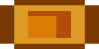
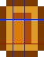
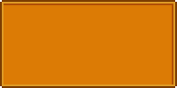

# Adding UI Assets

StardewUI has its own asset system based on SMAPI's own [content APIs](https://stardewvalleywiki.com/Modding:Modder_Guide/APIs/Content) but providing some additional features: [convention-based registration](#conventions) and [hot reload](hot-reload.md).

## Conventions

Assets are registered by _convention_ in StardewUI. You only need to specify where your assets are located, and it handles the translation between file names and asset names for you.

Suppose your mod looks as follows:

<div class="file-tree" markdown>
:material-folder: ModName
   :material-folder: assets
      :material-folder: sprites
         :material-code-json: ui.json
         :material-file-image: ui.png
      :material-folder: views
         :material-file-star-outline: config.sml
         :material-file-star-outline: gifts.sml
   :material-file-code: IViewEngine.cs
   :material-file-code: ModEntry.cs

</div>

For now, don't worry about what the various files do; the important thing is that [views](#adding-views) are in the directory `assets/views`, and the _asset prefix_ is a setting you provide. If you choose a prefix of `Mods/author.ModName/Views`, then the [asset names](https://stardewvalleywiki.com/Modding:Modder_Guide/APIs/Content#What.27s_an_.27asset_name.27.3F) for these assets will be:

- `Mods/author.ModName/Views/Config`
- `Mods/author.ModName/Views/Gifts`

That is, without the `assets/views` path and without the `.sml` extension.

## Adding Views

The actual "UI" in StardewUI is based on [Views](../concepts.md#views). When using the [framework](../framework/index.md)—which this part of the guide is based on—your views will be in the form of `.sml` ([StarML](../framework/starml.md)) files.

To create a view, simply create the `.sml` file in your desired location, such as the `assets/views/config.sml` used above. Refer to the [StarML guide](../framework/starml.md) or [examples](../examples/index.md) for more info on authoring views, i.e. what the actual contents of the file should be.

!!! tip "Important"

    Like any other mod content asset, you need to make sure that it is _deployed_ with your mod build; Visual Studio, VSCode, Rider, etc. do _not_ automatically do this for you. To do this:
    - Set **Build Action** to "Content"
    - Set **Copy to Output Directory** to "Copy always" or "Copy if newer"
    
    > 
    > 
    
    If you are not using any standard IDE or cannot find these settings, then you must add them to the `.csproj` file, e.g.
    
    ```xml
    <ItemGroup>
      <None Remove="assets\views\config.sml" />
    </ItemGroup>
    
    <ItemGroup>
      <Content Include="assets\views\config.sml">
        <CopyToOutputDirectory>PreserveNewest</CopyToOutputDirectory>
      </Content>
    </ItemGroup>
    ```

Once the physical files are set up, you can register the view folder – not the individual views – using the [API](index.md#adding-the-api):

```cs
viewEngine.RegisterViews("Mods/author.ModName/Views", "assets/views");
```

That's it—just a single line!

## Adding Sprites

Stardew Valley's visuals, like those of most 2D games, are based around [sprites](https://docs.monogame.net/articles/getting_to_know/whatis/graphics/WhatIs_Sprite.html). All of Stardew's image assets and most mod assets are in the form of "sprite sheets", more formally known as a [texture atlas](https://en.wikipedia.org/wiki/Texture_atlas), in which a single image (i.e. `.png` file) contains _many_ individual "objects", each occupying its own rectangular region.

Neither Stardew nor SMAPI have an explicit concept of a _sprite_. Since StardewUI needs to deal quite heavily with sprites, it defines its own [Sprite](../reference/stardewui/graphics/sprite.md) type, which includes not only the source image and rectangular region but also information pertaining to [9-slice scaling](https://en.wikipedia.org/wiki/9-slice_scaling), which is how it is able to display elements such as frame borders and menu backgrounds without having them appear awkwardly stretched.

A variety of useful UI sprites are already included in the [UiSprites](../reference/stardewui/graphics/uisprites.md) class, and each of these sprites is available to StarML via an [asset binding](../framework/starml.md#attribute-flavors) of the form `@Mods/StardewUI/Sprites/{Name}`; for example, `@Mods/StardewUI/Sprites/CaretRight`. However, Stardew Valley has thousands of individual sprites, and if you want to use anything that's not in `UiSprites`, or any sprite that you've produced yourself, then you need to register it as an asset.

You can accomplish this with [model binding](../concepts.md#data-binding) by providing a `Texture2D` or `Tuple<Texture2D, Rectangle>` property, as described in [conversion reference](../framework/starml.md#type-conversions), but the **recommended** way to deal with sprites is to register them with StardewUI.

In addition to allowing them to be used as asset bindings, like the `UiSprites`, StardewUI will also handle any cache management and hot reload for registered sprites, ensuring that (a) the UI will never crash because of an invalid (disposed) texture and (b) hot reload works correctly, and any changes to the game content, such as seasonal themes, are reflected immediately in the UI, even the UI is already on the screen.

The process is almost the same whether you intend to use vanilla assets or provide custom images/sprites in your mod. Sprites are registered by convention, similar to views:

```cs
viewEngine.RegisterSprites($"Mods/author.ModName/Sprites", "assets/sprites");
```

Continue reading for an explanation of what goes in `assets/sprites`.

### Vanilla Sprites

If you intend to take many images from a single texture atlas ("sprite sheet") then it is convenient to declare them all in one place. StardewUI provides a simple JSON structure for doing so. Suppose we are interested in the icons of various [buffs](https://stardewvalleywiki.com/Buffs):

```json title="assets/sprites/buffs.json"
{
    "Texture": "TileSheets/BuffsIcons",
    "Sprites": {
        "Fishing": {
            "SourceRect": "16, 0, 16, 16"
        },
        "Mining": {
            "SourceRect": "32, 0, 16, 16"
        },
        "MonsterMusk": {
            "SourceRect": "0, 32, 16, 16"
        }
    }
}
```

This instructs StardewUI to use the `LooseSprites/BuffsIcons` _texture_ as the source, and provides the rectangular regions (in the form `"left, top, width, height"`) of the individual sprites we want. It just so happens that these are all 16x16, but that will not necessarily always be the case; `LooseSprites/Cursors`, for example, is notorious for both its enormous size and its total irregularity.

#### Nine-Slicing

Another advantage of the JSON format is that you can specify [9-slice scaling](https://en.wikipedia.org/wiki/9-slice_scaling) options. Suppose we want to use this image as a background _(note: all images in this section have been scaled up 8x for clarity)_:


The Cursors sheet doesn't have this exact size; what it has instead is:


If we simply stretched this image to an arbitrary size, we would not get a good result:



Instead, we distinguish between the image's _borders_, which are not meant to stretch, and the _center_ or _middle_ slices which can stretch in one or both directions:



What we get are nine slices:

| | Left | Middle | Right |
| --- | --- | --- | --- |
| **Top** | No Stretch | Stretch Horizontal | No Stretch |
| **Middle** | Stretch Vertical | Stretch H + V | Stretch Vertical |
| **Bottom** | No Stretch | Stretch Horizontal | No Stretch |

In this specific case, it should be apparent that there are:

- 2 border pixels on the left
- 3 border pixels on top
- 3 border pixels on the right
- 2 border pixels on the bottom.

To configure this in the JSON:

```json title="assets/sprites/cursors.json"
{
    "Texture": "LooseSprites/Cursors",
    "Sprites": {
        "SpecialBorder": {
            "SourceRect": "129, 338, 7, 9",
            "FixedEdges": "2, 3, 3, 2",
            "Scale": 4
        }
    }
}
```

One additional property we've specified here is `Scale: 4`. This tells StardewUI to first scale uniformly by 4x, _then_ do the 9-slicing. The reason for this is that the Cursors image is based on a 16x16 "tile" size, but menus and other UI are based on a 64x64 "tile" size. Compare the version without scale to the version with scale:

| Unscaled | Scaled |
| :------: | :----: |
|  |  |

The unscaled version might look better in a web browser, but it will look strange in the game, appearing far too "HD" compared to the content around it and clashing with other UI.

Apply scaling according to the _reference size_ vs. _actual screen size_. If you are using sprites from `Maps/MenuTiles`, those are already designed for a 64x64 tile size and should not be scaled (no `Scale` field), only sliced (`FixedEdges` field).

### Custom/Modded Sprites

If the sprites you want to use are your own sprites, designed specifically for your mod (i.e. _not_ simply replacing a vanilla asset, in which case you should configure StardewUI with the [vanilla sprite](#vanilla-sprites) instead), then the configuration requires only a few small tweaks from vanilla:

1. Place your `.png` and `.json` files in the same directory, and give them the same name, e.g. `assets/sprites/ui.png` and `assets/sprites/ui.json`.
2. **Remove** the "Texture" line from the JSON file, so that it only contains `Sprites`. For instance, as used in one of the [examples](https://github.com/focustense/StardewUI/blob/dev/TestMod/assets/sprites/status.json):

    ```json title="assets/sprites/ui.json"
    {
        "Sprites": {
            "Checked": {
                "SourceRect": "0, 0, 9, 9",
            },
            "Unchecked": {
                "SourceRect": "9, 0, 9, 9",
            }
        }
    }
    ```
    

Aside from the addition of the `.png` file and the removal of the `Texture` field, it is exactly the same as a vanilla sprite.

### Referencing Sprites

When using JSON configuration, the primary asset is the Texture and JSON data itself. To reference an individual sprite, use the form: `{AssetPrefix}/{SpriteSheetName}:{SpriteName}`.

For example, using the previous example of [buff sprites](#vanilla-sprites), along with the [modded sprites](#custommodded-sprites), we might end up with the following template:

```html
<frame background={@Mods/author.ModName/Sprites/Cursors:SpecialBorder}>
    <image layout="36px 36px" sprite={@Mods/author.ModName/Sprites/UI:Checked} />
</frame>
```