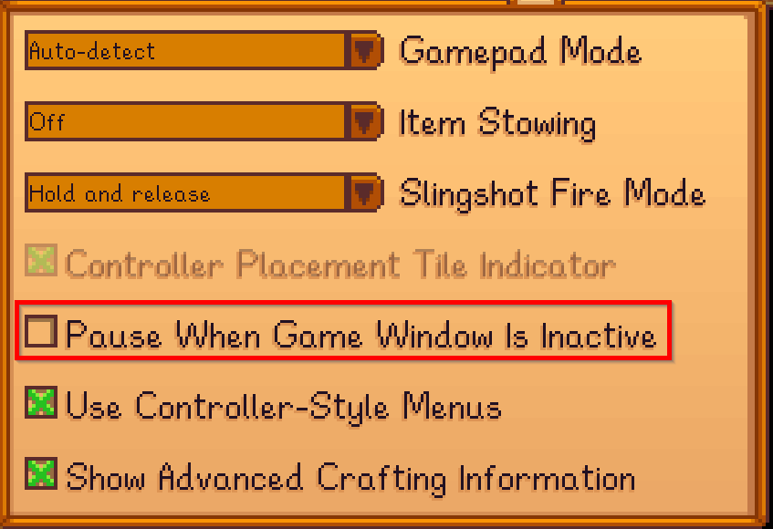

# Hot Reload

When using the recommended [asset registration](adding-ui-assets.md#adding-views) for views and sprites, StardewUI can watch for changes to asset files ([`.sml`](../framework/starml.md), `.png` and `json`) and update them immediately, even while the game is running and while the specific UI (menu, HUD, etc.) is open. This can be very useful for troubleshooting layout issues, making small tweaks toward a pixel-perfect UI, or simply using a playground for experimentation.

## Enabling Hot Reload

Once you have a [reference to the API](index.md#adding-the-api), turning on hot reload is a single method call:

```cs
viewEngine.EnableHotReloading();
```

A good place to do this is after the asset registrations, as in the [Example Mod](https://github.com/focustense/StardewUI/blob/v0.1.0/TestMod/ModEntry.cs#L36).

For best results, it is recommended to turn **off** the game setting labeled "Pause When Game Window Is Inactive":



Disabling this setting forces the game to process update ticks even while you are working in a separate window—such as your [code editor](editor-setup.md). This gives you truly _instant_ hot reload, without having to switch back to the game window.

### File Locations

Hot reload works on the **mod assets**; it does not know the original source of those assets.

!!! tip "Important"

    In order for hot reloading to work, make sure you are directly editing or copying your edits to the **deployed** files; that is, the file inside your `Stardew Valley\Mods\<ModName>` folder.

## Performance

When hot-reload is enabled, StardewUI must monitor your mod directory. While the overhead of doing so is generally low, having many mods do this at the same time(1) could cause lag/jank or other performance problems in game. To be polite to other modders, and players, it is recommended to turn off hot reload in the _released_ version of your mod, since players will not be using the feature themselves.
{ .annotate }

1.  The Framework API is partially scoped to each mod using it, and Hot Reload is a per-mod setting.

There are two ways to do this:

1. Remove the call to `EnableHotReloading()` before building your mod for release; or
2. Use [conditional compilation](https://learn.microsoft.com/en-us/dotnet/csharp/language-reference/preprocessor-directives#conditional-compilation). A simple and effective solution is to enable hot reloading in Debug mode only, as you will presumably be shipping the Release version.

    ```cs
    #if DEBUG
        viewEngine.EnableHotReloading();
    #endif
    ```

Conditional compilation is the recommended approach, as it is a permanent solution and avoids having hot-reloading accidentally enabled in a release build.