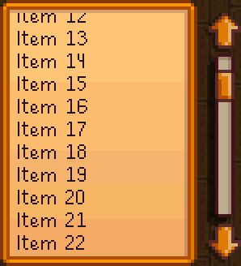

# Floating Elements

Layout generally flows from "outer" to "inner". A typical, simple menu might have a structure similar to the following:

    
Title Banner

    

        

            
Item 1 (clickable)

            
Item 2 (clickable)

            
Item 3 (clickable)

        

        
Some explanatory text

    

    

        X
    

Menus like this can be created using standard [layout views](standard-views.md#layouts), without any special considerations. The above structure is a vertical lane, containing a banner (title) and frame (content), which in turn has a horizontal lane with some images, etc.

However, conventional layout starts to become complicated and awkward when elements are introduced that are meant to participate in normal layout. Compare the [scrollable view](standard-views.md#scrollable-view) below to a typical desktop window; the Stardew style displays a scrollbar _outside_ the container:

/// html | div.no-header.vertical-center

| | |
| :---: | :---: |
|  |  |
| **Stardew Valley** | **Windows App** |

///

This difference isn't just cosmetic; in the Windows desktop app, the scrollbar actually takes away from the available space for text. If a scrollbar auto-hides, e.g. as would be the case when using CSS [`overflow: auto`](https://developer.mozilla.org/en-US/docs/Web/CSS/overflow)), then when the scrollbar does appear, the entire paragraph structure inside changes due to the shrinkage in content width.

In the Stardew Valley version, however, the width of the item list does not vary with scrollbar visibility. Thus the Stardew scrollbar can be said to be "floating" above the UI—it has its own internal layout, a vertical lane composed of the two arrows and track/thumb, but does not participate in the layout of its parent (the scrollable view).

## Float Behavior

Despite what might seem to be a similarity in terminology for web developers, StardewUI's [FloatingElement](../reference/stardewui/layout/floatingelement.md) **does not** have similar behavior to CSS [`float`](https://developer.mozilla.org/en-US/docs/Web/CSS/float). It is instead much closer to the CSS [`position: absolute`](https://developer.mozilla.org/en-US/docs/Web/CSS/position) attribute, assuming a `position: relative` parent.

Specifically, floating elements:

- Do not count as children for the purposes of [child limits](../framework/starml.md#child-limits).
- Are skipped in the layout pass of any [layout view](standard-views.md#layouts), being neither measured nor positioned, nor contributing to the layout's reported content size.
- Are positioned using a [FloatingPosition](../reference/stardewui/layout/floatingposition.md) with position selector—a function that accepts the parent size and self size, and returns the relative X/Y position of the float.
- Receive their parent's _actual_ size as their own [available size](../reference/stardewui/view.md#onmeasurevector2), so they can easily stretch to match the parent's width/height.
- Draw over top of any of their parent's direct children, if they happen to be positioned inside rather than outside.
- Can still receive hovers, clicks, focus searches and other events.

Typically, floating elements will be positioned relative to one of the edges (above/top, below/bottom, before/left, or after/right), sometimes with an additional offset, and this is the type of positioning supported in [StarML](../framework/starml.md#structural-attributes). If the element is part of a [custom view](custom-views.md) then there are no particular restrictions on positioning, except that the position is still relative to the parent, not the screen or menu.

## Comparison with Overlays

Floating elements have certain characteristics in common with overlays, and specifically [floating overlays](overlays.md#floating-overlays), but are meant for different scenarios. The table below compares the two.

| Trait/Feature | Floating Elements | Overlays |
| --- | --- | --- |
| Supported in [StarML](../framework/starml.md#structural-attributes) | Yes | No |
| Positioning | Relative to parent | Relative to viewport |
| Lifetime | Same as parent | Independent from parent (Overlay Stack) |
| Auto-close | N/A | When clicking outside or pressing menu key |
| Background dimming | No | Yes |
| Pointer events | Non-capturing | Capturing (blocks views underneath) |

In more general terms: overlays are for temporary "modes"—dialog boxes, drop-down lists, inline editors, etc.—while floating elements are for ordinary view content that happens to live outside the normal layout.

## Other Uses

Floating elements aren't only for obscure framework code; they are often the best solution for resolving high-level alignment issues. For example, consider the UI for the [Pen Pals](https://www.nexusmods.com/stardewvalley/mods/27489) mod:

What's notable here is the item frame on the left side. This UI looks best when the "NPC grid" is horizontally centered on screen, and the title banner is horizontally centered relative to the grid. By contrast, if the entire grid is pushed to the right because the entire menu is centered as a box, then it looks awkward and off-balance.

One way to resolve this—the older, "kludge" method—is to add a counterbalancing element on the right side, generally an invisible [spacer](standard-views.md#spacer). While this does work in some cases, there is no straightforward way to match the spacer width to the visible sidebar width, so it only works for balancing fixed-width columns. If the sidebar were to have variable width, or not always be visible, then the spacer hack causes problems.

Another way to attempt to resolve this is by manipulating gutters in the [menu controller](../getting-started/displaying-ui.md#menu-controllers) to create asymmetrical margins outside the menu. This also requires foreknowledge of the column widths, and only works at the level of an entire menu; if the adjustments need to be made somewhere _inside_ the menu, then this is also ineffective.

Negative margins are/were an even older hack, but don't always behave as expected in terms of receiving pointer or input events, and can make it difficult to keep inner content centered or right-aligned.

The cleanest and simplest solution here is to make the item preview a floating element, specifically a floating child of the main content frame (one level above the NPC grid) and positioned `before` it. This is a one-line change in the [StarML](../framework/starml.md) and compatible with all known input scenarios.

The same logic might apply to vertical centering; for example, you might want to display both a title banner at the top and button bar at the bottom, each a different height, while keeping the main content frame vertically-centered on screen. This can be done by floating both the title and button bar.

Any situations where conventional alignment is difficult are often good candidates for floats.