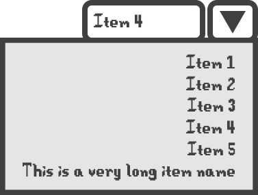

# Overlays

An overlay is some piece of UI—most often a [component view](custom-views.md#reusable-widgets)—that renders on top of other UI.

What makes overlays distinct from overlapping layout views like [panels](standard-views.md#panel) is that overlays "break out" of the layout of their parent [ViewMenu](../reference/stardewui/viewmenu-1.md) and any views inside it. They can choose to display adjacent to some other view, such as the item list in an open [drop-down list](standard-views.md#drop-down-list), or act like a full-screen submenu, such as the overlay used for [key bindings](standard-views.md#keybind-editor).

While this is achievable to some degree with `IClickableMenu.SetChildMenu` in vanilla Stardew Valley code, UI overlays have a number of advantages:

- They are much more lightweight in terms of both implementation and performance, requiring nothing more than an `IView`, and hooking into the event loop of whichever `ViewMenu` spawned it.
- Cursor [focus](../framework/focus-and-interaction.md) is automatically moved inside an overlay when it opens, and constrained to that overlay until it is closed.
- Mouse users can click anywhere outside an active overlay to dismiss it, much like any modern modal dialog. (The menu key, by default <kbd>Esc</kbd> or <kbd>E</kbd>, also still works here.)
- Menus **remember** the focus at the instant an overlay was opened, and can return the focus back to where it was when the overlay is closed.
- Overlays form a back-to-front stack, and any overlay can be removed even if it is not the topmost/innermost at the time.

Any view can open an overlay, but the most common reason to use one is to provide a space-conserving "read-only" view that can be clicked on to enter a modal "edit mode", as is done for drop-downs and keybind editors. When done carefully, it is possible to create flows that are impossible with normal layout, but still appear completely ordinary to users who may not even realize that an overlay is open.

Anything that implements [`IOverlay`](../reference/stardewui/overlays/ioverlay.md) can be an overlay, but most implementations will either use a floating overlay or a full-screen overlay.

## Floating Overlays

An overlay with no background or dimming can be called a "floating" overlay, being literally meant to float on top of some other UI. It can be positioned anywhere on the screen, but because this type of overlay normally exists to provide a sense of continuity with the UI that triggered it, will most often be positioned relative to some other view.

The [Overlay](../reference/stardewui/overlays/overlay.md) class can turn any existing `View` into a floating overlay, and has several properties to help with the aforementioned alignment. Consider the case of a drop-down menu, presented as a mockup here:



The "overlay" here is the box with gray background; it is not part of the normal layout of a drop-down list, which simply shows the current name and dropdown arrow. We can note a few things about its size and position:

- Its size is independent from the main dropdown, and its actual width is much larger due to having an unusually long item.
- The overlay's right edge is aligned with the dropdown's right edge; its left edge is allowed to vary according to the list's width.
- The overlay's top edge is aligned with the dropdown's bottom edge; i.e. it displays directly below the dropdown control.

The four `Alignment` properties are all necessary to fully specify this:

- `HorizontalAlignment` and `HorizontalParentAlignment` are both `End`: align the overlay's right/end edge to the owner's right/end edge.
- `VerticalAlignment` is `Start` and `VerticalParentAlignment` is `End`: align the overlay's top/start edge to the owner's bottom/end edge.

The code for this is similar to:

```cs
Overlay.Push(
    new Overlay(
        overlayView,
        this, // Parent view; can specify "this" if triggered from a View.
        horizontalAlignment: Alignment.End,
        horizontalParentAlignment: Alignment.End,
        verticalAlignment: Alignment.Start,
        verticalParentAlignment: Alignment.End
    ));
```

If no `parent` is specified, then all alignments are interpreted relative to the screen; absolute positioning can be achieved by omitting the `parent` or setting it to `null`, and then setting [ParentOffset](../reference/stardewui/overlays/overlay.md#parentoffset) to the desired top-left coordinate.

## Full-Screen Overlays

If an overlay should behave like a [dialog box](https://en.wikipedia.org/wiki/Dialog_box)—sometimes referred to as a [modal](https://getbootstrap.com/docs/4.0/components/modal/)—then there is a [FullScreenOverlay](../reference/stardewui/overlays/fullscreenoverlay.md) class to inherit from which makes this easier to achieve than the equivalent using a regular `Overlay`:

- Similar to a [`ComponentView`](../reference/stardewui/widgets/componentview-1.md), it owns its own view; instead of passing one into the constructor, as is the case with `Overlay`, you implement the [`CreateView`](../reference/stardewui/overlays/fullscreenoverlay.md#createview) method, as you would for `ComponentView`.
- It automatically dims the entire screen underneath the overlay; the amount can be adjusted via the [`DimmingAmount`](../reference/stardewui/overlays/fullscreenoverlay.md#dimmingamount) property.
- Unlike `Overlay`, it has an overridable `Update` method in case it needs to do some extra work every frame.
- Although the alignment properties exist, because they are part of the `IView` interface, they normally don't need to be set, since the default alignment is to center the content and default behavior is to cover the whole screen.

The difference between `Overlay` and `FullScreenOverlay` is not as stark as the difference between [component views](custom-views.md#reusable-widgets) and [custom layouts](custom-views.md#custom-layout-or-drawing); `FullScreenOverlay` is simply a convenience class and can be swapped out for a more general `Overlay` at any point.

The [keybind editor](standard-views.md#keybind-editor) is an example of using a full-screen overlay; see the source of [KeybindOverlay](https://github.com/focustense/StardewUI/blob/dev/Core/Widgets/Keybinding/KeybindOverlay.cs) for an example implementation.

## Displaying and Removing Overlays

Overlays form a visual stack; not a literal `Stack<T>`, but a back-to-front order that is used for [focus capture](../framework/focus-and-interaction.md), event propagation, z-ordering/dimming, etc. The "front" overlay receives all input, but all visible overlays are shown and continue to receive updates.

The most common operations will be **[Pushing](../reference/stardewui/overlays/overlay.md#pushioverlay)** an overlay to the front:

```cs
Overlay.Push(new MyOverlay(...));
```

and **[Removing](../reference/stardewui/overlays/overlay.md#removeioverlay)** an overlay from wherever it happens to be:

```cs
Overlay.Remove(myOverlay);
```

There is also a [`Pop`](../reference/stardewui/overlays/overlay.md#pop) method, as the stack-like semantic implies, which removes the overlay currently at the front. However, this method is mainly used by the framework itself, e.g. to close an overlay when one of the cancel buttons is pressed or when the mouse is clicked outside the overlay. If you need to close your _own_ overlay, then it is better to `Remove` it explicitly, in case it is not actually at the top of the stack.

## Overlay Context

The static `Push`, `Pop` and `Remove` methods of the [`Overlay`](../reference/stardewui/overlays/overlay.md) class are all wrappers around [`OverlayContext`](../reference/stardewui/overlays/overlaycontext.md). Context is actually instanced per `ViewMenu`, but since all UI is single-threaded, StardewUI applies some magic behind the scenes so that [`OverlayContext.Current`](../reference/stardewui/overlays/overlaycontext.md#current) is always pointing to the correct context from whichever call site uses it, similar to the way `Game1` always reflects the current player/viewport in split-screen mode.

This type is public, so if for some reason you need to look at the entire stack, e.g. to determine if your overlay is at the front, then `OverlayContext` can provide it; simply obtain the context via `OverlayContext.Current`, and inspect its overlays in either [back-to-front](../reference/stardewui/overlays/overlaycontext.md#backtofront) or [front-to-back](../reference/stardewui/overlays/overlaycontext.md#fronttoback) order.

Directly accessing or manipulating the context is rare, so only use it when there is a specific reason, e.g. if you are writing framework-level code.