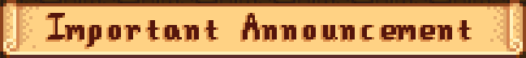

# Standard Views

## Layouts

### Frame &nbsp; [:material-book-open-variant:](../reference/stardewui/widgets/frame.md)

Applies decorations and alignment to an inner view.

Frames are very similar to [panels](#panel), but support customizable backgrounds, borders and shadows, and only allow a single content view. Use them for menu borders, group boxes, item placeholders, and anywhere else that content needs to stand out or be visually divided from other content.

=== "Demo"

    

=== "Usage (StarML)"

    ```html
    <frame layout="400px 200px"
           background={@Mods/StardewUI/Sprites/MenuBackground}
           border={@Mods/StardewUI/Sprites/MenuBorder}
           border-thickness="36, 36, 40, 36"
           horizontal-content-alignment="middle"
           vertical-content-alignment="middle"
           padding="32,16,32,24">
        <label font="dialogue" text="Frame Content" />
    </frame>
    ```

=== "Usage (C#)"

    ```cs
    void ShowFrameExample()
    {
        Game1.activeClickableMenu = viewEngine.CreateMenuFromAsset(
            $"Mods/focustense.StardewUITest/Views/FrameTestView",
            null);
    }
    ```

### Grid &nbsp; [:material-book-open-variant:](../reference/stardewui/widgets/grid.md)

Lays out items as a uniform grid (AKA table), where "uniform" means that each "cell" has the same size. Can be oriented either horizontally (ordered left-to-right, then wrapping to the next row) or vertically (ordered top-to-bottom, then wrapping to the next column).

Choose from either type of `item-layout`:

- Fixed length (`length: nn`), where the width (or height, in vertical orientation) is constant and the grid wraps whenever it reaches the end of the row; or
- Fixed count (`count: nn`), where the number of items per row (or column, in vertical orientation) is constant and the grid automatically adjusts their size to fit.

When using the `length` variant, a `+` can be added to the end (e.g. `length: 64+`) to request that column/row sizes be increased so that the cells fill the entire width/height available for layout; this allows for fluid layouts that can adapt to different screen sizes without leaving awkward white space before or after the content.

The `+` modifier cannot be used with the `count` variant because count-based layouts already use a dynamic cell size.

!!! note

    Grids must have a size independent of their content in the direction of their orientation; i.e. a grid with horizontal orientation must have a width **other than** `content`, and a grid with vertical orientation must have a height other than `content`.
    
    While it might seem logical to combine `item-layout="count: n"` with a fixed-size child layout such as `<image layout="64px 64px" />` in order to create a dynamically-sized grid, this isn't how it works in practice; the size of a grid cell can only be determined based on the grid's own properties, not the content inside it. If you expect to have a variable number of rows/columns _and_ a variable width/height, use nested [Lanes](#lane) instead.

=== "Demo"

    

=== "Usage (StarML)"

    ```html
    <grid layout="400px 300px"
          item-layout="length: 64"
          item-spacing="16,16"
          horizontal-item-alignment="middle">
        <image layout="stretch content" *repeat={Items} sprite={this} />
    </grid>
    ```

=== "Usage (C#)"

    ```cs
    void ShowGridExample()
    {
        Game1.activeClickableMenu = viewEngine.CreateMenuFromAsset(
            $"Mods/focustense.StardewUITest/Views/GridTestView",
            EdiblesViewModel.LoadFromGameData());
    }
    ```
    
    Note: For the source of `EdiblesViewModel`, see the [Scrolling Item Grid](../examples/scrolling-item-grid.md#ediblesviewmodelcs) example.

### Lane &nbsp; [:material-book-open-variant:](../reference/stardewui/widgets/lane.md)

Lays out items in a straight line, either horizontally or vertically.

Can align items to any edge, and supports dynamically sized items; e.g. if an item with `stretch` length is placed in a lane with other, fixed-length items, then the `stretch` item will resize to whatever width is left over.

Lanes are the bread and butter of content layout; almost any UI design can be represented as some combination of horizontal and vertical lanes.

=== "Demo"

    

=== "Usage (StarML)"

    ```html
    <lane orientation="vertical">
        <label margin="0, 0, 0, 4" font="dialogue" text="Choose Item" />
        <label *repeat={Items} margin="16, 4" text={Text} />
    </lane>
    ```

=== "Usage (C#)"

    ```cs
    partial class LaneTestItem(string name) : INotifyPropertyChanged
    {
        public string Text => $"{IsSelected ? '>' : '*'} {name}";
        
        [Notify] private bool isSelected;
    }
    
    class LaneTestViewModel()
    {
        public List<LaneTestItem> Items { get; set; } = [
            new("Item1") { IsSelected = true },
            new("Item2"),
            new("Item3"),
            new("Item4"),
        ];
    }
    
    void ShowLaneExample()
    {
        Game1.activeClickableMenu = viewEngine.CreateMenuFromAsset(
            $"Mods/focustense.StardewUITest/Views/LaneTestView",
            new LaneTestViewModel());
    }
    ```

### Panel &nbsp; [:material-book-open-variant:](../reference/stardewui/widgets/panel.md)

Lays out and draws multiple items in the same space, in a back-to-front order.

Panels are similar to [frames](#frame), but instead of decoration, their main purpose is intentional overlap—for example, drawing some text or a small icon on top of another image.

All children are given the same bounding rectangle for layout, and can be "positioned" using alignment and margins. By default, the order that the children are added is the order in which they will be drawn, i.e. the last element will be drawn over top of any previous elements, but this can be overridden by adding a `z-index` attribute to one or more elements.

=== "Demo"

    

=== "Usage (StarML)"

    ```html
    <panel layout="64px" vertical-content-alignment="end">
        <image layout="stretch" margin="4" sprite={ItemData} />
        <lane vertical-content-alignment="end">
            <image layout="24px" sprite={Quality} />
            <spacer layout="stretch 0px" />
            <digits number={Count} />
        </lane>
    </panel>
    ```
    
    !!! note
    
        Binding the image's `sprite` to an `ItemQuality` enum requires a [custom converter](../framework/extensions.md#custom-converters).

=== "Usage (C#)"

    ```cs
    enum ItemQuality { Silver, Gold, Iridium }
    
    class PanelTestViewModel
    {
        public ParsedItemData ItemData { get; set; }
        public ItemQuality Quality { get; set; }
        public int Count { get; set; }
    }
    
    void ShowPanelExample()
    {
        Game1.activeClickableMenu = viewEngine.CreateMenuFromAsset(
            $"Mods/focustense.StardewUITest/Views/PanelTestView",
            new PanelTestViewModel()
            {
                ItemData = ItemRegistry.GetData("(O)266"), // Pizza
                Quality = ItemQuality.Iridium,
                Count = 39
            });
    }
    ```

### Scrollable View &nbsp; [:material-book-open-variant:](../reference/stardewui/widgets/scrollableview.md)

A rectangular area that can be scrolled to show off-screen content. Combines both the scrollable container, which holds the element's children, and the scrollbar itself, which is automatically synchronized with the content and shown/hidden when necessary.

Scrollable views can be used to hold simple lists, grids, or an entire complex UI with many different widgets such as a configuration menu. All [scrolling behavior](../framework/focus-and-interaction.md#scrolling) such as the mouse wheel and gamepad's right stick movement are built in, and the container will scroll automatically when elements inside the container are `focusable`.

!!! tip

    To improve discoverability, set a [`peeking`](../framework/focus-and-interaction.md#peeking) value large enough so that the user can always see whether there is more content to scroll through.

=== "Demo"

    

=== "Usage (StarML)"

    ```html
    <scrollable layout="200px 300px" peeking="64">
        <lane orientation="vertical">
            <label *repeat={Items} text={this} focusable="true" />
        </lane>
    </scrollable>
    ```

=== "Usage (C#)"

    ```cs
    class ScrollableTestViewModel(int count)
    {
        public IReadOnlyList<string> Items { get; } =
            Enumerable.Range(0, count).Select(i => $"Item {i + 1}").ToArray();
    }
    
    void ShowScrollableExample()
    {
        Game1.activeClickableMenu = viewEngine.CreateMenuFromAsset(
            $"Mods/focustense.StardewUITest/Views/ScrollableTestView",
            new ScrollableTestViewModel(100));
    }
    ```

## Content

### Banner &nbsp; [:material-book-open-variant:](../reference/stardewui/widgets/banner.md)

Displays banner-style text.

This is most often used for ["scroll text"](https://www.kdau.com/scrollish/) as shown in the example below. However, the background is optional, and customizable; the real function of this widget is to draw text with the special "title font", which is not available as a normal [SpriteFont](https://docs.monogame.net/api/Microsoft.Xna.Framework.Graphics.SpriteFont.html) and therefore cannot be used with [labels](#label).

In addition to being used with backgrounds as menu titles, banners are also commonly used without backgrounds as section headings in longer vertical menus.

=== "Demo"

    

=== "Usage (StarML)"

    ```html
    <banner background={@Mods/StardewUI/Sprites/BannerBackground}
            background-border-thickness="48,0"
            padding="12"
            text="Important Announcement" />
    ```

### Image &nbsp; [:material-book-open-variant:](../reference/stardewui/widgets/image.md)

Draws a [Sprite](../reference/stardewui/graphics/sprite.md). Functionally very similar to interacting with the [SpriteBatch](https://docs.monogame.net/api/Microsoft.Xna.Framework.Graphics.SpriteBatch.html), but significantly more streamlined for use in UI layouts:

- Built-in [9-slice scaling](https://en.wikipedia.org/wiki/9-slice_scaling); simply set the edge lengths on the input sprite.
- Has multiple [fit](../reference/stardewui/widgets/image.md#fit) options; choose whether the image should be scaled uniformly to fit inside the layout area ([letterboxing](https://en.wikipedia.org/wiki/Letterboxing_(filming)) or [pillarboxing](https://en.wikipedia.org/wiki/Pillarbox)), covering the layout area ([clipping](https://en.wikipedia.org/wiki/Clipping_(computer_graphics))) or stretched non-uniformly across the area.
- Shadows, tint, alignment, uniform rotation and other quality-of-life features.

Static images are usually bound to some [sprite asset](../getting-started/adding-ui-assets.md#adding-sprites), as shown in the example below. For dynamic images, several common [implicit conversions](../framework/starml.md#type-conversions) are available.

=== "Demo"

    

=== "Usage (StarML)"

    ```html
    <image layout="stretch content"
           sprite={@Mods/focustense.StardewUITest/Sprites/Cursors:TrainFront} />
    ```

### Label &nbsp; [:material-book-open-variant:](../reference/stardewui/widgets/label.md)

Draws text as a single line or paragraph.

Existing newlines are preserved, and all measurements (e.g. breaking) are handled as part of the layout; the text can be limited in length using `max-lines`, or can be given unlimited length and placed inside a `content`-sized container or `scrollable`.

The `font` will accept any `SpriteFont` if you have a custom font, otherwise the built-in game values are `small` (default), `dialogue` (large) and `tiny` (not actually tiny, but the game calls it `tinyFont`). MonoGame does not support font sizes per font, but this can be simulated via `scale`, which also applies to layout—i.e. will affect how much space is occupied by the label and/or how many lines can be displayed.

Aside from [banners](#banner), the `label` element should be all that the majority of UIs ever need for text.

=== "Demo"

    

=== "Usage (StarML)"

    ```html
    <label max-lines="6" text={Text} />
    ```

=== "Usage (C#)"

    ```cs
    class LabelTestViewModel
    {
        public string Text { get; set; }
    }
    
    void ShowLabelExample()
    {
        Game1.activeClickableMenu = viewEngine.CreateMenuFromAsset(
            $"Mods/focustense.StardewUITest/Views/LabelTestView",
            new LabelTestViewModel()
            {
                Text = "Out in the kitchen. That skillet good and greasy John Henry "
                     + "has been the ruin of me, the buggies and the hacks all "
                     + "formed in line steel driving crew weevil cold wind blows "
                     + "constant sorrow, turkey in the straw, five dollars one arm "
                     + "round my whiskey keg sun would never shine when I was a "
                     + "little boy aces backed with eights, wheel hoss baby on her "
                     + "knee handsome stranger Jack-a-Diamonds out in the kitchen."
            });
    }
    ```
    
    _(Filler text generated from [Hillbilly Ipsum](https://hillbillyipsum.com))_

### Spacer &nbsp; [:material-book-open-variant:](../reference/stardewui/widgets/spacer.md)

Adds space between other elements. Has no visual appearance on its own.

The most common usage of this is to align elements to opposite edges of a layout view such as a [Lane](#lane). For example, a title-bar-like control normally has title text and optional icon on the left side, and actions on the right side.

Alignment cannot be specified on individual elements, since only layout views control layout. One way to handle separate alignments would be to use a [panel](#panel) with additional panels, lanes, etc. as children, each aligning to a different edge. However, for cases where overlap is not required or expected, it is simpler and quicker to add a spacer with one of its dimensions set to `stretch`.

=== "Demo"

    

=== "Usage (StarML)"

    ```html
    <lane layout="300px content">
        <label text="Hello" />
        <spacer layout="stretch 0px" />
        <label text="World" />
    </lane>
    ```

Spacers can also be fixed-width and/or fixed-height; there is no requirement for `stretch`, it is only the most common usage.

### Tiny Number Label &nbsp; [:material-book-open-variant:](../reference/stardewui/widgets/tinynumberlabel.md)

Called `<digits>` in [StarML](../framework/starml.md) for conciseness, but originally named after the utility function `drawTinyDigits` in Stardew Valley. Displays numbers, and _only_ numbers, using sprites that are much smaller than built-in [label](#label) fonts will generally allow. Typically shown on top of an item to indicate the quantity or stack size.

=== "Demo"

    
    
    (image enlarged for clarity)

=== "Usage (StarML)"

    ```html
    <digits number="529" />
    ```

## Interactivity

### Button &nbsp; [:material-book-open-variant:](../reference/stardewui/widgets/button.md)

Your basic clickable button. Supports an optional alternate hover background and shadow, although the vanilla game generally does not do this for its own buttons.

Most buttons are text buttons, and can be set up easily with just the `text` attribute. However, you can also customize what is inside the button, similar to a [frame](#frame), by removing the `text` attribute and adding a child element instead. Both examples are shown below.

=== "Demo"

    
    &nbsp;
    

=== "Usage (StarML)"

    **Text Only**
    
    ```html
    <button text="Click Me" />
    ```
    
    **Custom**
    
    ```html
    <button>
        <lane padding="8" vertical-content-alignment="middle">
            <image layout="content stretch"
                   sprite={@Mods/focustense.StardewUITest/Sprites/Cursors:AttackIcon} />
            <label margin="16, 0, 0, 0" text="Attack Buffs" />
        </lane>
    </button>
    ```

### Checkbox &nbsp; [:material-book-open-variant:](../reference/stardewui/widgets/checkbox.md)

An image that can be toggled between two states (generally, on or off) by clicking on it. The image is customizable; default sprites are used in the example below.

Includes a `label-text` property that adds text next to the image; importantly, _the text can also be clicked_ to toggle the option, which improves usability by providing a much larger target in which the click can land.

=== "Demo"

    

=== "Usage (StarML)"

    ```html
    <checkbox label-text="Enable killer pumpkins"
              is-checked={<>EnableKillerPumpkins} />
    ```

=== "Usage (C#)"

    ```cs
    partial class CheckboxTestViewModel : INotifyPropertyChanged
    {
        [Notify] private bool enableKillerPumpkins;
    }
    
    void ShowCheckboxExample()
    {
        Game1.activeClickableMenu = viewEngine.CreateMenuFromAsset(
            $"Mods/focustense.StardewUITest/Views/CheckboxTestView",
            new CheckboxTestViewModel());
    }
    ```

!!! tip

    Don't forget to use a [two-way binding](../framework/starml.md#binding-modifiers) or output binding in order to receive the value of `is-checked` in your model; this is much simpler and more efficient than using the `click` event.

### Color Picker &nbsp; [:material-book-open-variant:](../reference/stardewui/widgets/colorpicker.md)

Editor widget for entering a color value, with a small initial footprint that can be expanded into a complete dialog.

In its collapsed form, the color is represented as a hex color and the hex value can be edited directly like a regular [text input](#text-input); while editing, the swatch will show the resulting color.

Clicking on the swatch brings up the full color picker which includes both RGBA (horizontal sliders) and HSVA (hue/saturation wheel and value/alpha vertical sliders) editing options, as well as a list of preset swatches which can be customized by the author.

Note that the HSVA section requires mouse input, since the design is inherently incompatible with gamepad controllers. RGBA sliders and preset swatches can be navigated via controller.

=== "Demo"

    

=== "Usage (StarML)"

    ```html
    <color-picker color={<>BackgroundColor} />
    ```

=== "Usage (C#)"

    ```cs
    partial class ThemeViewModel : INotifyPropertyChanged
    {
        [Notify] private bool backgroundColor;
    }
    
    void ShowColorPickerExample()
    {
        Game1.activeClickableMenu = viewEngine.CreateMenuFromAsset(
            $"Mods/focustense.StardewUITest/Views/ThemeTestView",
            new ThemeViewModel());
    }
    ```

### Drop-Down List &nbsp; [:material-book-open-variant:](../reference/stardewui/widgets/dropdownlist-1.md)

Provides a drop-down (AKA pull-down) menu to select from a list of options.

These are better-behaved than the vanilla drop-down lists in Stardew Valley; they follow the standard drop-down design of click to open, and click again to select/close, and gamepad cursors automatically move to the selected option when the list is opened and back to the toggle button when the list is closed.

It is usually a good idea to set `option-min-width` so that the selection box does not change size depending on the length of the selected item.

=== "Demo"

    

=== "Usage (StarML)"

    ```html
    <dropdown options={Weapons}
              option-format={Format}
              option-min-width="200"
              selected-option={<>SelectedWeapon} />
    ```

=== "Usage (C#)"

    ```cs
    enum WeaponType { Sword, Club, Dagger, Slingshot, Special }
    
    partial class DropDownTestViewModel : INotifyPropertyChanged
    {
        public Func<WeaponType, string> Format { get; } = wt => wt switch
        {
            WeaponType.Sword => "Slashy",
            WeaponType.Club => "Smashy",
            WeaponType.Dagger => "Stabby",
            WeaponType.Slingshot => "Stretchy",
            _ => "Banana"
        };
    
        public IReadOnlyList<WeaponType> Weapons { get; } =
            Enum.GetValues<WeaponType>();
    
        [Notify] private WeaponType selectedWeapon;
    }
    
    void ShowDropDownExample()
    {
        Game1.activeClickableMenu = viewEngine.CreateMenuFromAsset(
            $"Mods/focustense.StardewUITest/Views/DropDownTestView",
            new DropDownTestViewModel());
    }
    ```

!!! info "Option Types"

    Drop-down lists in [StarML](../framework/starml.md) use a special, dynamically-typed wrapper over the generic [DropDownList](../reference/stardewui/widgets/dropdownlist-1.md) which enables it to adjust to any option type; the example above defines a completely new option named `WeaponType`.
    
    In order for this to work, **all option-related properties must use the same type.** These properties are the ones shown above: `options`, `option-format` and `selected-option`. Any type can be used for all three, as long as the entire view model is consistent.

### Expander &nbsp; [:material-book-open-variant:](../reference/stardewui/widgets/expander.md)

An expandable panel with built-in behavior to toggle expand/collapse on click. The header is always visible, while the content is only visible when expanded.

Includes its own (customizable) caret sprite to show the current expanded state.

=== "Demo"

    

=== "Usage (StarML)"

    ```html
    <frame layout="420px 380px"
           background={@Mods/StardewUI/Sprites/ControlBorder}
           padding="32,16,32,24">
        <lane layout="stretch content" orientation="vertical">
            <expander layout="stretch content"
                      margin="0,0,0,4"
                      header-padding="0,12"
                      header-background-tint="#99c"
                      is-expanded={<>IsExpanded}>
                <label *outlet="header" text={HeaderText} />
                <image layout="stretch 300px"
                       horizontal-alignment="middle"
                       sprite={@Mods/focustense.StardewUITest/Sprites/Cursors:Balloon} />
            </expander>
            <label text="Additional content below expander" />
        </lane>
    </frame>
    ```

=== "Usage (C#)"

    ```cs
    partial class ExpanderTestViewModel : INotifyPropertyChanged
    {
        public string HeaderText => IsExpanded ? "Hide Details" : "Show Details";
    
        [Notify] private bool isExpanded;
    }
    
    void ShowExpanderExample()
    {
        Game1.activeClickableMenu = viewEngine.CreateMenuFromAsset(
            $"Mods/focustense.StardewUITest/Views/ExpanderTestView",
            new ExpanderTestViewModel());
    }
    ```

### Keybind &nbsp; [:material-book-open-variant:](../reference/stardewui/widgets/keybinding/keybindview.md)

Displays the current, non-editable value of a single SMAPI `Keybind`.

Requires a `sprite-map` in order to display correctly. The shipped version of StardewUI includes a built-in map asset, shown below; it can either be used without any arguments (i.e. ending in `/Buttons`) or with an argument list in the following format:

`keyboardTheme-mouseTheme-sliceScale`.

Valid values for either theme are `dark`, `light`, `stardew` (orange) or `default` which behaves the same as `stardew`. Controller buttons are always shown in a dark style.

For `sliceScale`, smaller numbers make the border edges thinner; for a `button-height` of 64px, a scale of `0.5` is typically good. Adjust to preference; typically, the smaller the button is, the smaller the ideal scale should be.

=== "Demo"

    

=== "Usage (StarML)"

    ```html
    <keybind button-height="64"
             sprite-map={@Mods/StardewUI/SpriteMaps/Buttons:default-default-0.5}
             empty-text="Not set"
             keybind={Hotkey} />
    ```

=== "Usage (C#)"

    ```cs
    class KeybindTestViewModel
    {
        public Keybind Hotkey { get; set; } =
            new(SButton.LeftStick, SButton.ControllerA);
    }
    
    void ShowKeybindExample()
    {
        Game1.activeClickableMenu = viewEngine.CreateMenuFromAsset(
            $"Mods/focustense.StardewUITest/Views/KeybindTestView",
            new KeybindTestViewModel());
    }
    ```
    
    Note: The example image shows two appearances, one for keyboard bindings and one for controllers. The example code will only produce one, but both images are produced from the exact same view, populated with different keybind values.

### Keybind Editor &nbsp; [:material-book-open-variant:](../reference/stardewui/widgets/keybinding/keybindlisteditor.md)

An editable version of the [keybind](#keybind) view supporting the same options, except taking a `keybind-list` instead of a `keybind` for adding multiple bindings. Includes built-in overlay to capture input when adding/changing a binding.

Although it is designed to work with multiple keybindings (SMAPI `KeybindList`), the behavior can be adjusted to work with only a single keybinding or even a single button, by changing the `editable-type` property (see [KeybindType](../reference/stardewui/widgets/keybinding/keybindtype.md) for details). If no `editable-type` is specified, the binding cannot be edited. When the value is `MultipleKeybinds`, as shown below, the overlay includes an "add" button whose text can be customized with the `add-button-text` attribute.

=== "Demo"

    

=== "Usage (StarML)"

    ```html
    <keybind-editor button-height="64"
                    sprite-map={@Mods/StardewUI/SpriteMaps/Buttons:default-default-0.5}
                    editable-type="MultipleKeybinds"
                    add-button-text="Add"
                    empty-text="Not set"
                    focusable="true"
                    keybind-list={<>Keybinds} />
    ```

=== "Usage (C#)"

    ```cs
    partial class KeybindListTestViewModel : INotifyPropertyChanged
    {
        [Notify]
        private KeybindList keybinds = new(
            new Keybind(SButton.LeftControl, SButton.F5),
            new Keybind(SButton.LeftStick, SButton.ControllerA));
    }
    
    void ShowKeybindEditorExample()
    {
        Game1.activeClickableMenu = viewEngine.CreateMenuFromAsset(
            $"Mods/focustense.StardewUITest/Views/KeybindEditorTestView",
            new KeybindListTestViewModel());
    }
    ```

### Segments

Displays a set of options, such as the values of an `enum` type, in a segmented UI, similar to iOS [segmented controls](https://developer.apple.com/design/human-interface-guidelines/segmented-controls) or Material Design [segmented buttons](https://m3.material.io/components/segmented-buttons).

Segments are the contemporary equivalent for the classic [radio button](https://en.wikipedia.org/wiki/Radio_button) group. In many cases they can be a better choice than a [dropdown](#drop-down-list) for selecting one out of a few options, as they have several advantages:

- All selectable options are immediately visible;
- Fewer clicks are needed to navigate/select an option;
- Tooltips can be shown per option, providing more information on what each option does.

It is best to use segments when the number of options is small, i.e. no more than 3 or 4. Mobile HID guidelines often suggest that each segment be given the same width, which can be done automatically by specifying `balanced="true"` in the attributes; however, this can require significantly more horizontal space, further limiting how many options can fit in a given UI.

Segmented controls can be created with or without separators and transition animations.

=== "Demo"

    

=== "Usage (StarML)"

    ```html
    <segments highlight={@Mods/StardewUI/Sprites/White}
              highlight-tint="#38c"
              highlight-transition="150ms EaseOutCubic"
              separator={@Mods/StardewUI/Sprites/White}
              separator-tint="#333"
              separator-width="2">
        <label margin="12, 8"
               text="Easy"
               tooltip="0.5x purchase price, 2x sell price" />
        <label margin="12, 8"
               text="Normal"
               tooltip="No price modifiers" />
        <label margin="12, 8"
               text="Hard"
               tooltip="2x purchase price, 0.5x sell price" />
    </segments>
    ```

Although segments are classified here as interaction, they are also technically a [layout view](#layouts) in the sense that the actual inner "segments" are simply the view's child nodes. One important implication of this is that, unlike dropdowns, segmented controls do not make many assumptions about data binding, and it is up to the author to figure out the details.

Most mods can use a relatively standard data binding setup for simple use cases such as enums; for a more comprehensive example, refer to [`EnumSegmentsViewModel`](https://github.com/focustense/StardewRadialMenu/blob/dev/RadialMenu/UI/EnumSegmentsViewModel.cs) and the [`enum-segments`](https://github.com/focustense/StardewRadialMenu/blob/5033d13999a632c8cf46c8e24dff700e835ffec9/RadialMenu/assets/ui/views/Controls.sml#L88) template.

### Slider &nbsp; [:material-book-open-variant:](../reference/stardewui/widgets/slider.md)

A draggable thumb inside a fixed-width track, ideal for editing numeric values.

All sliders are `float` based, but can be given the visual appearance of an integer slider by setting `interval` to a whole number. Use the `min` and `max` attributes to control the range, and `value-format` to customize how the label next to the track/thumb appears.

Controller-based editing simply requires pressing the d-pad or left stick while the slider is focused.

=== "Demo"

    

=== "Usage (StarML)"

    ```html
    <slider track-width="200"
            min="10"
            max="100"
            interval="5"
            value-format={Format}
            value={<>Money} />
    ```

=== "Usage (C#)"

    ```cs
    partial class SliderTestViewModel : INotifyPropertyChanged
    {
        public Func<float, string> Format { get; } =
            value => $"{value} million dollars";
    
        [Notify] private float money = 10;
    }
    
    void ShowSliderExample()
    {
        Game1.activeClickableMenu = viewEngine.CreateMenuFromAsset(
            $"Mods/focustense.StardewUITest/Views/SliderTestView",
            new SliderTestViewModel());
    }
    ```

### Tab &nbsp; [:material-book-open-variant:](../reference/stardewui/widgets/tab.md)

A rectangular content frame with rounded top, which shifts its position slightly to indicate whether or not it is active.

Generally used as part of a tab group where only one tab can be active at a time.

In addition to supporting data binding on the active state, the tab automatically activates or "presses" on click, and raises events on activation and deactivation.

When using the default sprite, the background will stretch and any inner content (i.e. whether text or image) can generally be represented.

=== "Demo"

    

=== "Usage (StarML)"

    ```html
    <lane z-index="1">
        <tab *repeat={Tabs}
             layout="64px"
             tooltip={Name}
             active={<>Active}
             activate=|^OnTabActivated(Name)|>
            <image layout="32px" sprite={Sprite} vertical-alignment="middle" />
        </tab>
    </lane>
    ```

=== "Usage (C#)"

    ```cs
    partial class TabData(string name, Texture2D texture, Rectangle sourceRect)
        : INotifyPropertyChanged
    {
        public string Name { get; } = name;
        public Tuple<Texture2D, Rectangle> Sprite { get; } =
            Tuple.Create(texture, sourceRect);
    
        [Notify] private bool active;
    }
       
    partial class TabsViewModel
    {
        public IReadOnlyList<TabData> Tabs { get; set; } = [];
    
        public void OnTabActivated(string name)
        {
            foreach (var tab in Tabs)
            {
                if (tab.Name != name)
                {
                    tab.Active = false;
                }
            }
        }
    }
    
    private void ShowTabsExample()
    {
        var context = new TabsViewModel()
        {
            Tabs =
            [
                new("Home", Game1.mouseCursors, new(20, 388, 8, 8)) { Active = true },
                new("Social", Game1.mouseCursors, new(36, 374, 7, 8)),
                new("Money", Game1.mouseCursors, new(4, 388, 8, 8)),
                new("Seasons", Game1.mouseCursors, new(420, 1204, 8, 8)),
            ],
        };
        Game1.activeClickableMenu = viewEngine.CreateMenuFromAsset(
            $"Mods/focustense.StardewUITest/Views/TabTestView",
            context);
    }
    ```

### Text Input &nbsp; [:material-book-open-variant:](../reference/stardewui/widgets/textinput.md)

An input box similar to the one where you enter your farm name, Favorite Thing, etc. Supports a movable caret (cursor) using the mouse, arrow keys, or home/end keys; also supports gamepad input using Stardew's on-screen keyboard.

The appearance is highly customizable, with editable fonts, colors, background and caret images, shadows and more. Consult the API reference for details.

=== "Demo"

    

=== "Usage (StarML)"

    ```html
    <textinput layout="stretch 54px" text={<>Text} />
    ```

=== "Usage (C#)"

    ```cs
    partial class TextInputTestViewModel : INotifyPropertyChanged
    {
        [Notify] private string text = "";
    }
    
    void ShowTextInputExample()
    {
        Game1.activeClickableMenu = viewEngine.CreateMenuFromAsset(
            $"Mods/focustense.StardewUITest/Views/TextInputTestView",
            new TextInputTestViewModel()
            {
                Text = "It was the best of times, it was the blurst of times."
            });
    }
    ```

!!! tip

    Set a fixed or `stretch` width and height for text input boxes; they don't do well with the default `content` layout since the content changes and may initially be empty.

## Extras

### Marquee &nbsp; [:material-book-open-variant:](../reference/stardewui/widgets/marquee.md)

A not-very-serious widget named after the long-deprecated HTML [Marquee](https://developer.mozilla.org/en-US/docs/Web/HTML/Element/marquee) element. Scrolls content infinitely similar to a classic electronic billboard.

This was mostly done as a demonstration of what's possible in StardewUI, e.g. with a [custom view](custom-views.md). The inner content does not have to be simple text; anything from images to entire UIs can be auto-scrolled this way, but since the scrolling is a drawing trick rather than a layout trick, it is not recommended to put any interactive ([focusable](../framework/focus-and-interaction.md#focusability)) elements inside the marquee.

=== "Demo"

    <video controls autoplay loop>
      <source src="../../videos/example-marquee.mp4" type="video/mp4">
    </video>

=== "Usage (StarML)"

    ```html
    <marquee layout="stretch content" padding="0,4" speed="150" extra-distance="80">
        <label text={Text} />
    </marquee>
    ```

=== "Usage (C#)"

    ```cs
    class MarqueeTestViewModel
    {
        public string Text { get; set; }
    }
    
    void ShowMarqueeExample()
    {
        Game1.activeClickableMenu = viewEngine.CreateMenuFromAsset(
            $"Mods/focustense.StardewUITest/Views/MarqueeTestView",
            new MarqueeTestViewModel()
            {
                Text = "Pickle my bones in alcohol stranger, and I ain't "
                     + "comin' back Jimmy crack corn and I don't care " +
                     + "wildwood flower died when I was young run, what I had done."
            });
    }
    ```
    
    _(Filler text generated from [Hillbilly Ipsum](https://hillbillyipsum.com))_

!!! tip

    Be sure to set a `layout` on the marquee element that does not depend on content size, otherwise the entire marquee will stretch out of bounds and potentially off-screen instead of clipping the content.