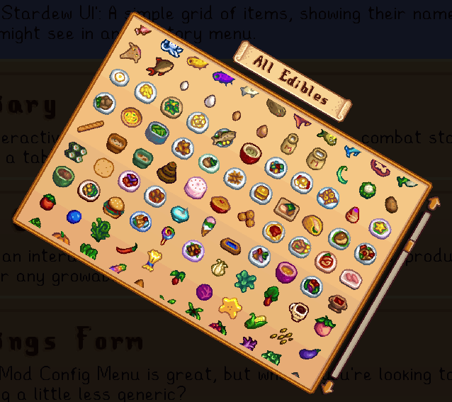

<style type="text/css">
    .transform-example {
        display: flex;
        align-items: center;
    }
    
    .transform-origin-example {
        display: flex;
        flex-direction: row;
        gap: 16px;
    }
    
    .transform-origin-example + .transform-origin-example {
        margin-top: 1em;
    }
    
    .transform-origin-spacer {
        width: 160px;
    }

    .transform-example p {
        display: inline-block;
    }
    
    .transform-annotate {
        display: flex;
        flex-direction: column;
        gap: 4px;
    }
    
    .transform-container {
        display: inline-block;
        background: var(--md-code-bg-color);
        padding: 32px;
        font-size: 36px;
    }
    
    .transform-origin-example .transform-container {
        padding: 48px;
    }
    
    .transform-element {
        display: flex;
        width: 64px;
        height: 64px;
        align-items: center;
        justify-content: center;
    }
    
    .transform-caption {
        display: block;
        font-size: 0.8em;
        font-style: italic;
        text-align: center;
        line-height: 1.3em;
    }
    
    .transform-from {
        background: var(--md-primary-fg-color);
    }
    
    .transform-to {
        background: var(--md-accent-fg-color);
    }
    
    .transform-arrow-container {
        display: inline-block;
        min-width: 200px;
        margin: 0 1em;
        text-align: center;
    }
    
    .transform-arrow {
        display: block;
        font-size: 36px;
    }
    
    .transform-description {
        display: block;
        margin-top: 1em;
    }
</style>

# Transforms

Like their [CSS equivalent](https://developer.mozilla.org/en-US/docs/Web/CSS/transform), transforms in StardewUI change the visual appearance of a view without changing its [layout](../concepts.md#layout). This makes them much more efficient for [animations](animation.md) than layout, and capable of behaviors such as [rotation](#rotation) that are not possible with conventional layout.

In [StarML](../framework/starml.md), the equivalent of a [Transform](../reference/stardewui/graphics/transform.md) is a semicolon-separated string of individual translation properties, such as `scale: 1.2; rotate: 90; translateX: 120`. The complete list of supported properties is as follows:

| Property     | Effect                      | Value Types             | Example Values                          |
| ------------ | --------------------------- | ---------------------   | --------------------------------------- |
| `rotate`     | [Rotation](#rotation)       | `float`<br/>_(degrees)_ | `45`, `180`                             |
| `scale`      | [Scale](#scale)             | `float`<br/>`Vector2`   | `2.5`<br/>`1, 1.5`                      |
| `scaleX`     | [Scale](#scale)             | `float`                 | `0.5`<br/>_(same as `scale: 0.5, 1`)_   |
| `scaleY`     | [Scale](#scale)             | `float`                 | `0.5`<br/>_(same as `scale: 1, 0.5`)_   |
| `translate`  | [Translation](#translation) | `Vector2`               | `100, -50`                              |
| `translateX` | [Translation](#translation) | `float`                 | `20`<br/>_(same as `translate: 20, 0`)_ |
| `translateY` | [Translation](#translation) | `float`                 | `20`<br/>_(same as `translate: 0, 20`)_ |

## Types of Transforms

While a transform can in practice be literally any [matrix](https://en.wikipedia.org/wiki/Transformation_matrix), the ones that are natively supported in [StarML](../framework/starml.md) are the "big three" - scale, rotation and translation.

### Scale

The `scale` transform makes the element appear larger or smaller. Scale can either be a scalar value (single number) or vector (X and Y).

<div class="transform-example" markdown>
<div class="transform-container">
    <div class="transform-element transform-from">A</div>
</div>
<div class="transform-arrow-container" markdown>
:material-arrow-right:{ .transform-arrow }
`scale: 1.5`{.transform-description}
</div>
<div class="transform-container">
    <div class="transform-element transform-to" style="transform: scale(1.5)">A'</div>
</div>
</div>

If the X and Y values are the same, e.g. with `scale: 2`, `scale: 2, 2` or `scaleX: 2; scaleY: 2`, then this is said to be a "uniform" scale that preserves the original aspect ratio. If the X and Y values are different, such as `scale: 2, 3` or `scaleX: 2, scaleY: 3` then it is "non-uniform" scaling or "stretching".

In general, uniform scaling will look better and have slightly better performance. Stretching tends to be used only for specific effects like barn-door [wipes](https://en.wikipedia.org/wiki/Wipe_(transition)) or an old CRT screen turning on/off. Non-uniform scales are **not** able to take advantage of [nine-slicing](../getting-started/adding-ui-assets.md#nine-slicing) since nine-slicing is a layout function, and transforms occur after layout.

### Rotation

The `rotate` transform performs a 2D rotation (in 3D terms, this is a Z-rotation) with any arbitrary angle, specified in degrees.

!!! warning "Important - Rotation Units"

    Degrees are used in [StarML `transform` attribute](../framework/starml.md#common-attributes) string values because constants like 𝜋 and arithmetic operations on it (e.g. `𝜋/2` for a quarter turn) aren't available in markup, whereas angles like 90° and 180° are easy to write. Note however that rotational values [in the API](../reference/stardewui/graphics/transform.md#rotation), including when used in [duck typing](../framework/starml.md#duck-typing), are **always specified in radians**.

<div class="transform-example" markdown>
<div class="transform-container">
    <div class="transform-element transform-from">A</div>
</div>
<div class="transform-arrow-container" markdown>
:material-arrow-right:{ .transform-arrow }
`rotate: 45`{.transform-description}
</div>
<div class="transform-container">
    <div class="transform-element transform-to" style="transform: rotateZ(45deg)">A'</div>
</div>
</div>

While MonoGame already makes it possible to draw a single sprite or text string with rotation, the real power of rotation transforms is in the ability to rotate an entire layout or menu, with correct results when inner elements are themselves scaled or rotated. Ever wanted to make your own epic, cheesy [spinning newspaper](https://tvtropes.org/pmwiki/pmwiki.php/Main/spinningpaper) effect? Now you can.



### Translation

The "simplest" transform is translation, which simply moves the element by some specified distance. This distance is always a vector; unlike [scale](#scale), it cannot be a scalar value. For translations along a single axis, `translateX` and `translateY` can be used as shorthand.

<div class="transform-example" markdown>
<div class="transform-container">
    <div class="transform-element transform-from">A</div>
</div>
<div class="transform-arrow-container" markdown>
:material-arrow-right:{ .transform-arrow }
`translate: 24, 18`{.transform-description}
</div>
<div class="transform-container">
    <div class="transform-element transform-to" style="transform: translate(24px, 18px)">A'</div>
</div>
</div>

Translation is actually the basis for all conventional layout-based drawing; [views](../concepts.md#views), including [layout views](standard-views.md#layouts), do not simply pick a global `X, Y` position at which to draw; instead they draw themselves at `(0, 0)` and add a translation before delegating to any positioned child views, so that those child views can also draw at `(0, 0)`, and so on.

Applying a `translation` transformation is using the same mechanism, with an _additional_ translation offset to the offset already used for layout.

!!! info "Trivia"

    Why not simply carry the X and Y positions down the hierarchy? Because translation, like the other types, is a _local_ transformation; if the context is already rotated (e.g. in the [rotation](#rotation) example above, where the entire menu is rotated), then `translateX` is not simply adding to the X value anymore; what the grid sees as its own X-axis is actually rotated 30° from the screen's X-axis.

## Transform Origin

All the previous examples have been illustrated using transforms (scale, rotation) around the center. However, because UI flows explicitly from top-left to bottom-right, rather than expanding equally in all directions, this center origin is not actually the default behavior. In StardewUI, and in XNA/MonoGame in general, the default origin for every transformation is to use the top-left corner unless otherwise specified.

This makes no difference for [translation](#translation)—it can easily be shown, both visually and mathematically, that the origin of a pure translation has no effect on the outcome. For rotations, scales and other arbitrary matrix transforms, however, the result's apparent position on screen will be significantly affected by the origin.

StardewUI's [TransformOrigin](../reference/stardewui/iview.md#transformorigin) works in the same intuitive way as the [CSS `transform-origin`](https://developer.mozilla.org/en-US/docs/Web/CSS/transform-origin) property, **not** the awkward `origin` argument in XNA/MonoGame APIs. Specifically, modifying the transform origin only affects the _transform itself_, not the actual _position of the object_. Changing the `transform-origin` in StardewUI/StarML has no effect until an origin-sensitive `transform` is added.

Transform origins are vectors between `(0, 0)` and `(1, 1)` and are **relative** to the size of the transformed view:

- `(0, 0)` transforms around the top-left corner (default)
- `(0.5, 0.5)` transforms around the center
- `(1, 1)` transforms around the bottom-right corner.

Any `Vector2` is technically allowed but the three above are the most commonly-used. The following rows demonstrate the outcomes of the same `scale` and `rotate` transforms using these different origins.

<div class="transform-origin-example" markdown>
<div class="transform-annotate">
<div class="transform-container">
    <div class="transform-element transform-from">A</div>
</div>
<div class="transform-caption">Original</div>
</div>
<div class="transform-annotate">
<div class="transform-container">
    <div class="transform-element transform-to" style="transform: scale(1.5); transform-origin: top left">A'</div>
</div>
<div class="transform-caption">Scale: 1.5<br/>Origin: 0, 0</div>
</div>
<div class="transform-annotate">
<div class="transform-container">
    <div class="transform-element transform-to" style="transform: scale(1.5); transform-origin: center">A'</div>
</div>
<div class="transform-caption">Scale: 1.5<br/>Origin: 0.5, 0.5</div>
</div>
<div class="transform-annotate">
<div class="transform-container">
    <div class="transform-element transform-to" style="transform: scale(1.5); transform-origin: bottom right">A'</div>
</div>
<div class="transform-caption">Scale: 1.5<br/>Origin: 1, 1</div>
</div>
</div>

<div class="transform-origin-example" markdown>
<div class="transform-origin-spacer"></div>
<div class="transform-annotate">
<div class="transform-container">
    <div class="transform-element transform-to" style="transform: rotate(45deg); transform-origin: top left">A'</div>
</div>
<div class="transform-caption">Rotate: 45°<br/>Origin: 0, 0</div>
</div>
<div class="transform-annotate">
<div class="transform-container">
    <div class="transform-element transform-to" style="transform: rotate(45deg); transform-origin: center">A'</div>
</div>
<div class="transform-caption">Rotate: 45°<br/>Origin: 0.5, 0.5</div>
</div>
<div class="transform-annotate">
<div class="transform-container">
    <div class="transform-element transform-to" style="transform: rotate(45deg); transform-origin: bottom right">A'</div>
</div>
<div class="transform-caption">Rotate: 45°<br/>Origin: 1, 1</div>
</div>
</div>

If you are scaling/rotating an object but want it to "stay in place", make sure to use `transform-origin="0.5, 0.5"`. All other origins, including the default origin of `0, 0`, will cause its position on screen to shift, sometimes quite dramatically depending on the size of the object.

## Transform Order

In general, StardewUI's transforms are very close to CSS transforms, but they differ in one very important detail: a CSS `transform` property is a "transform sequence", specifying an arbitrary number of individual transforms to apply in order. In StardewUI, this is **not the case**; transform strings are used to build a single [Transform](../reference/stardewui/graphics/transform.md), with a single component each for scale, rotation and translation, and duplicate values are ignored.

For example, with CSS transforms, the following values all produce **different** results:

- `translateX(100px) rotate(45deg) translateX(100px)`
- `translateX(200px) rotate(45deg)`
- `rotate(45deg) translateX(200px)`.

However, in StardewUI, the following values all produce the **same** result:

- `translateX: 100; rotate: 45`
- `translateX: 100; rotate: 45; translateX: 100`
- `rotate: 45; translateX: 100`

This is because all the different components are combined by the parser into a single local `Transform` which will have a [Translation](../reference/stardewui/graphics/transform.md#translation) of `100, 0` and [Rotation](../reference/stardewui/graphics/transform.md#rotation) of `𝜋/4` rads.

StardewUI's parser does have logic to combine "x" and "y" properties; for example, `scaleX: 1.2, scaleY: 1.4` will be combined into a transform whose scale is the vector `(1.2, 1.4)`. However, the _values_ do not accumulate, only the attributes; duplicate attributes will replace the previous value, which is why `translateX: 456, translateX: 100` simply produces a translation of `(100, 0)`.

Local transformations involving arbitrarily-long sequences, as in the CSS example earlier, are rare in practice, but if it is necessary to produce a similar outcome in StardewUI, then it can only be done using nested transforms, such as:

```html
<panel transform="translateX: 100; rotate: 45">
    <panel transform="translateX: 100">
        <!-- transformed content -->
    </panel>
</panel>
```

Components of local transformations always apply in the same order: first scale, then rotation, then translation. However, different people visualize the transformation process differently (in model space vs. in view/world space), therefore the CSS comparison can be used as a reference. Specifically, in StardewUI, any of the following transform strings:

- `rotate: 45; translateX: 100; scale: 1.5`
- `scale: 1.5; translateX: 100; rotate: 45`
- `translateX: 100; scale: 1.5; rotate: 45`

are always equivalent to the following in CSS:

`translateX(100px) rotate(45deg) scale(1.5)`

And this equivalence is because web browsers perform CSS translations [in right-to-left order](https://developer.mozilla.org/en-US/docs/Web/CSS/transform#values).